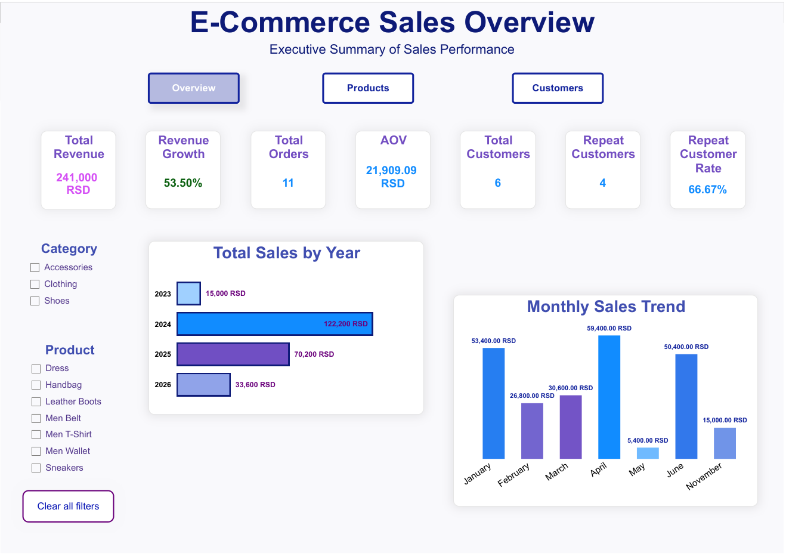
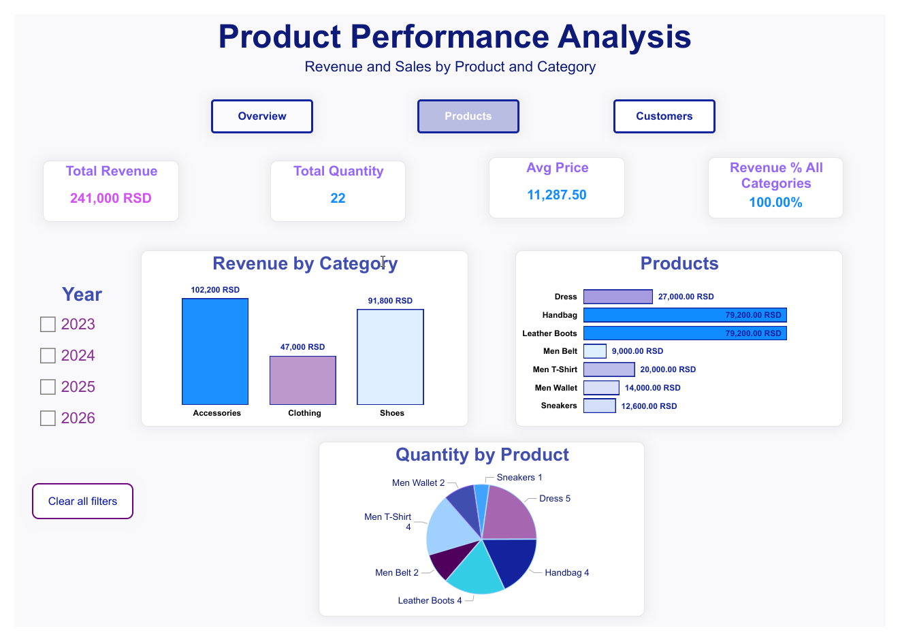
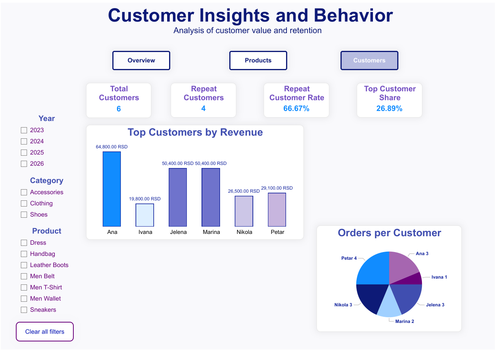

<h1 align="center">E-Commerce Sales Analysis Project</h1>

**End-to-end sales analysis project** covering database design, data validation, and interactive dashboards — built with MySQL, Excel, and Power BI.

## Project Overview
This project represents a complete sales data analysis workflow, starting with database creation and data insertion in SQL, continuing with data validation and pivot analysis in Excel, and finishing with interactive dashboards in Power BI.
The goal of the project is to analyze sales performance, customer behavior, and revenue trends using realistic e-commerce data.

## Dashboard Preview
### 🔵 Overview – Sales Performance

High-level view of revenue, growth, orders, and customer KPIs.
 
 

### 🔵 Products – Revenue & Category Breakdown

Analysis of product performance and category contribution.
 
 

### 🔵 Customers – Behavior & Retention

Insights into customer behavior, repeat purchases, and top customers.
 
 

________________________________________
## 📁 Project Structure
| File | Description |
|------|-------------|
| `e_sale_analysis.sql` | Database schema + analytical queries |
| `e_sale_analysis.xlsx` | Data validation and pivot analysis |
| `e_sale_analysis.pbix` | 3-page Power BI dashboard |
| `images/` | Dashboard screenshots |

________________________________________
## 🗄️ MySQL – Database Design & Queries
### Database Structure
A relational database was designed and created from scratch using MySQL.
#### Tables:
*   *Categories*
*   *Customers*
*   *Products*
*   *Orders*
*   *Order Items*

#### Key concepts used:
Primary keys & foreign keys 
One-to-many relationships 

## SQL Operations
The database was populated with sample data and analyzed using advanced SQL queries.
#### SQL techniques applied:
*   *JOIN (INNER JOIN)*
*   *GROUP BY, ORDER BY*
*   *Agregate functions (SUM, COUNT)*
*   *HAVING clause*
*   *Subqueries*
*   *VIEW creation for reusable logic*

## Business Analysis Queries 
*   *Total revenue*
*   *Total value per order*
*   *Customer revenue analysis*
*   *Customers with multiple orders*
*   *Average Order Value (AOV)*
*   *Orders above a certain value*
*   *Revenue by product category*
*   *Top products by quantity and revenue*
   
File: e_sale_analysis.sql
________________________________________
## 📋 Excel –  Data Validation & Pivot Analysis
The exported SQL dataset was imported into Excel for additional validation and exploratory analysis.
### Excel Activities
Data consistency checks
### Creating Pivot Tables:
*   *Total sales by category and Year*
*   *Sales by month*
*   *Top customers by revenue*
*   *Average Order Value (AOV)*
*   *Basic charts to verify trends and distributions*
  
File: e_sale_analysis.xlsx
________________________________________
## 📈 Power BI – 3-Page Interactive Dashboard
Power BI was used to create an interactive and business-oriented dashboard for sales analysis.

### 🔵 Page 1 · Overview
| Metric | Value |
|--------|-------|
| Total Revenue | 241,000 RSD |
| Total Orders | 11 |
| AOV | 21,909 RSD |
| Revenue Growth | 53.50% |
| Peak Month | April (59,400 RSD) |

Includes KPI cards, monthly trend (line chart), and order status with tooltip breakdown. 
 

### 🔵 Page 2 · Product Performance

| Metric | Value |
|--------|-------|
| Top Category | Accessories (102,200 RSD – 42.4%) |
| Top Products | Handbag & Leather Boots (79,200 RSD each) |
| Total Quantity Sold | 22 units |
| Avg Product Price | 11,287.50 RSD |

Focuses on product contribution, category performance, and sales distribution. 
 

### 🔵 Page 3 · Customer Insights

| Metric | Value |
|--------|-------|
| Total Customers | 6 |
| Repeat Customers | 4 |
| Repeat Customer Rate | 66.67% |
| Top Customer Share | 26.89% |

Analyzes customer behavior, retention, and revenue concentration. 
 

## 🧮 DAX Measures  

The dashboard includes several calculated measures built using DAX to support business analysis:

*   **Total Revenue** - Calculates total sales value based on price and quantity
*   **Total Orders** - Counts the number of unique orders
*   **Average Order Value (AOV)** - Measures average revenue per order
*   **Revenue Growth (%)** - Shows revenue change compared to the previous period (YoY)
*   **Repeat Customers** - Identifies customers with more than one order
*   **Repeat Customer Rate (%)** - Percentage of customers who made multiple purchases
*   **Revenue by Category (%)** - Shows contribution of each category to total revenue
*   **Completed Revenue / Pending Revenue** -  Revenue split based on order status 
*   **Top Customer Share (%)** -  Shows how much revenue is generated by top customers

These measures are dynamically calculated and respond to filters and slicers. 
 

## 🧠 Key Insights  

- A small number of customers drives a significant share of total revenue  
- Repeat customers represent over 66% of customers → strong retention signal  
- Revenue shows clear growth trend over time  
- Certain categories dominate total sales performance  
 

## 📊 Data Model  

- Relational dataset designed in SQL  
- Calendar table created for time intelligence (Year-over-Year analysis)  
- Relationship established between Calendar[Date] and Order Date  
- DAX measures used for KPI calculations  
 

## 🚀 Project Outcome  

This dashboard enables:

- Clear monitoring of sales performance  
- Identification of top products and customers  
- Understanding of customer retention  
- Data-driven decision-making  
 
  
File: e_sale_analysis.pbix
________________________________________
## 🛠️ Tools & Technologies

- MySQL  
- Excel  
- Power BI  

________________________________________

## 👤 Author  

**Marina Kovačević**  
[LinkedIn](https://linkedin.com/in/marina-kovacevic-data)  
[GitHub](https://github.com/kovacevicmarina)

